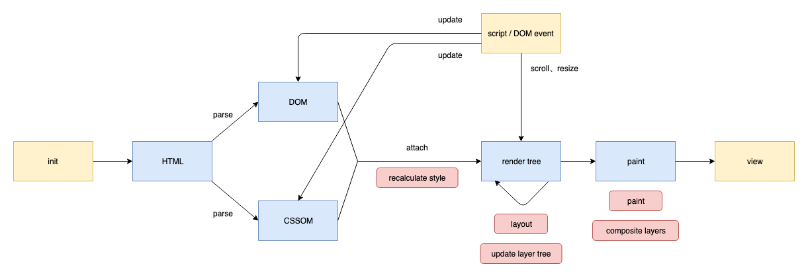
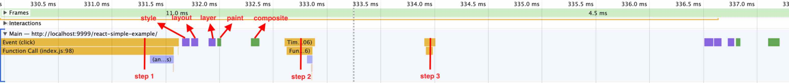
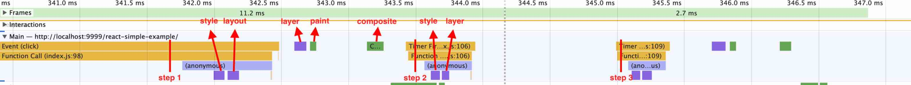
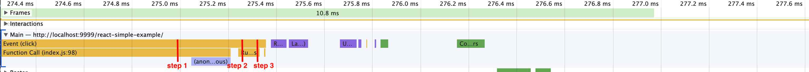
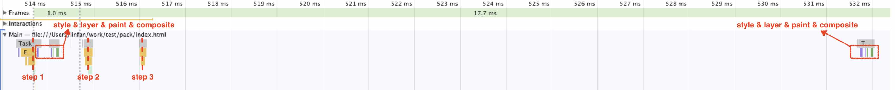

# 页面渲染

不同浏览器的内核不同，对渲染的实现略有差异，这里以chrome为例。

## 渲染过程

页面渲染的几个关键步骤

1. recalculate style (style)：计算应用到各元素的css规则
2. layout：重新计算各元素位置（即reflow，当仅repaint时此步会跳过）
3. update layer tree (layer)：更新渲染树
4. paint：绘制元素
5. composite layers (composite)：把各个图层合成为最终结果

## 渲染时机

当JS修改了元素样式，浏览器并不是立刻将新样式渲染在屏幕上，而是把render tree的flag标记为dirty。在**下一个渲染时机**如果判断此flag为true，就执行完整渲染过程。

**渲染时机**一般在每轮事件循环（task）的结束前，但如果此时距离上次渲染的时间点不足1帧（1帧一般为16.66ms左右，不同浏览器和显示器下会有差异），则渲染推迟到下1帧的时间点。因为这1帧时间内可能样式还会再次被修改，每次修改都立刻渲染是无意义的，两次渲染的时间间隔应大于等于1帧。

但有时渲染过程中的layout会被**提前**，而不是等到达渲染时机再执行。比如在**同一轮task里**，修改了layout相关样式后，又**对layout相关属性进行了读取**，则浏览器会立刻执行recalculate style和layout来返回准确的laytou数据，但也只是提前了这2个步骤，后续步骤不影响。

渲染过程中的layout可能被跳过，比如对样式的修改不影响layout，则只需repaint而不需reflow。

### 结合例子

创建一个div为例子，在body上绑定click事件对div进行修改

    const div = document.createElement('div');
    div.style.cssText = 'width: 100px; height: 100px; background: red';
    document.body.appendChild(div);

    document.body.addEventListener('click', () => {
      // do something...
    });

在click回调中，分别采用如下代码来测试，用chrome的performance工具分析结果

1. 多轮task

    document.body.addEventListener('click', () => {
      div.style.height = 110 + 'px'; // step 1
      setTimeout(() => {
        div.style.height = 120 + 'px'; // step 2
          setTimeout(() => {
            div.style.height = 130 + 'px'; // step 3
          }, 0);
      }, 0);
    });

在step 1当轮事件循环结束后，浏览器重新执行了完整的5步渲染过程。

然而step 2执行以后一直到step 3执行（即使step 2那轮的事件循环已结束），浏览器都没有渲染，直到step 3执行以后才再次渲染，因为step 2执行完距离上次渲染完毕的时间还不到1帧，所以浏览器忽略了这次渲染（但对DOM、CSSOM的改动是实时生效的，只是没有去渲染）。

2. 多轮task中，强制读取layout

    document.body.addEventListener('click', () => {
      div.style.height = 110 + 'px'; // step 1
      console.log(div.offsetHeight);
      setTimeout(() => {
        div.style.height = 120 + 'px'; // step 2
        console.log(div.offsetHeight);
          setTimeout(() => {
            div.style.height = 130 + 'px'; // step 3
            console.log(div.offsetHeight);
          }, 0);
      }, 0);
    });

和第一种写法唯一不同的地方在于，每个step后面都加上了对layout的读取。结果不同的是，每次执行读取，浏览器都会立刻强制提前执行style和layout来保证读取到正确的结果，后面的步骤不变。

3. 带有microTask的task

    document.body.addEventListener('click', () => {
      div.style.height = 110 + 'px'; // step 1
      Promise.resolve().then(() => {
        div.style.height = 120 + 'px'; // step 2
        Promise.resolve().then(() => {
          div.style.height = 130 + 'px'; // step 3
        });
      });
    });

在带有microTask的情况中，step 1和作为microTask的step 2、step 3都执行完毕，也就是当轮事件循环结束后，才进行渲染。其实和把3步step都用同步执行的结果是一样的。

4. 多轮task，只进行repaint

    document.body.addEventListener('click', () => {
      div.style.background = '#123'; // step 1
      setTimeout(() => {
        div.style.background = '#456'; // step 2
          setTimeout(() => {
            div.style.background = '#789'; // step 3
          }, 0);
      }, 0);
    });

和第一种写法唯一不同的地方在于，每个step是对background（非layout属性）修改，而非对height修改，结果浏览器渲染过程跳过了layout这一步来提高性能。

5. 使用requestAnimationFrame

    document.body.addEventListener('click', () => {
      div.style.height = 110 + 'px'; // step 1
      requestAnimationFrame(() => {
        div.style.height = 120 + 'px'; // step 2
        requestAnimationFrame(() => {
          div.style.height = 130 + 'px'; // step 3
        });
      });
    });

step 1执行完毕后浏览器执行了style和layout，由于有requestAnimationFrame任务，则在本次页面绘制前（执行layer前）会先执行这个回调，执行完回调再继续执行layer、paint、composite。

但如果在一次requestAnimationFrame执行过程中，又执行了新的requestAnimationFrame，则新的回调会在下次绘制前执行，而非本次绘制。

## GPU加速

dom的绘制信息会被分成多个格栅上传GPU绘制。

浏览器会按规则把页面分为多个合成层，合成层上的变动只需重绘这个层。

### 创建合成层

某些情况下节点会被单独升级为合成层（比如：transform、opacity、canvas标签、手动加上will-change、有个比自己index低的合成层时 等），浏览器会独立绘制各个合成层，最后再复合而成最终页面，合成层内的dom变动只需要重绘这个层，更高效。

### 结论

- 尽量多用transform
- 在合理时机设置will-change
- 把合成层的index尽可能调高（避免自动创建不必要的合成层）
