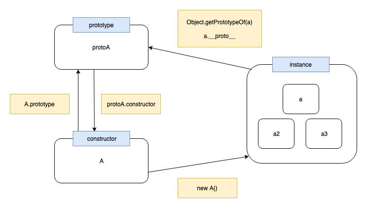
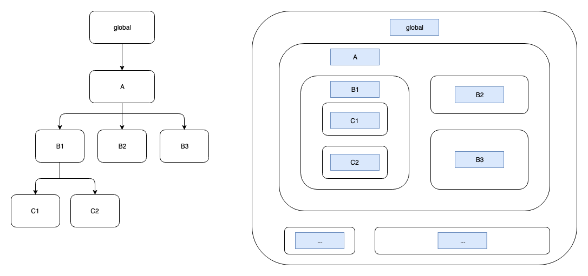
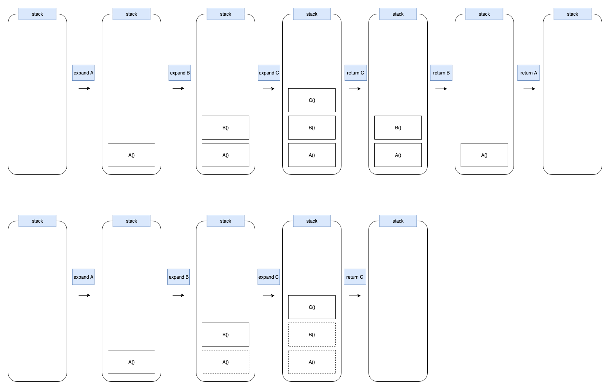

# JS(ECMA)

## JS 和 ECMA 的关系

European Computer Manufacturers Association（ECMA）是一个制定计算机标准的机构。[ECMAScript（ECMA-262）](https://tc39.es/ecma262/) 是 ECMA 制定的一种编程语言规范，有跨平台特性。此规范主要由 TC39 团队维护。

JavaScript（JS） 是 ECMAScript 的一种实现，广义的 JS 除了遵循 ECMAScript 标准之外，还基于平台特性提供一些额外 API，比如在浏览器内的 JS 有 DOM 操作相关的 API。

此章仅讨论 ECMAScript 标准下的 JS，不包括平台相关的特性。

## 类型转换

### 数字转字符串

```js
1 + ''; // '1'
(1).toString(); // '1'
String(1); // '1'
```

### 字符串转数字

```js
+'1'; // 1
Number.parseFloat('1'); // 1
Number(1); // 1
```

### 对基本类型的属性读写

我们可以直接对某个基本类型调用方法，比如`'string'.indexOf('s')`。

JS 引擎在编译阶段，如果发现有对基本类型的属性读取，则会先将其包装为对应的对象再执行，比如：

```js
'asd'.indexOf('s'); // 1
// equal to
new String('asd').indexOf('s'); // 1
```

```js
Number.prototype.asd = 123;

(1).asd; // 123
// equal to
new Number(1).asd; // 123
```

但如果是对属性的写入，则无效，但也不报错：

```js
const str = 'asd';
str.prop = 'f'; // 写入失败，但不报错
str.prop; // undefined
```
### 类型的隐式转换

每个类型的数据都有一个内部的`[Symbol.toPrimitive]`方法，当需要对数据类型隐式转换时会调用它。

此方法接收一个`hint`参数，即`[Symbol.toPrimitive](hint)`，运行时根据上下文自动按规则决定 hint 取值（string/number/default）。

内置的`[Symbol.toPrimitive](hint)`调用流程如下：

- string 场景: try `data.toString()` -> try `data.valueOf()` -> throw error

- number/default场景: try `data.valueOf()` -> try `data.String()` -> throw error

也可以对`[Symbol.toPrimitive]`进行改写，搬运一个MDN上的例子：

```js
// An object without Symbol.toPrimitive property.
var obj1 = {};
console.log(+obj1);     // NaN
console.log(`${obj1}`); // "[object Object]"
console.log(obj1 + ''); // "[object Object]"

// An object with Symbol.toPrimitive property.
var obj2 = {
  [Symbol.toPrimitive](hint) {
    if (hint == 'number') {
      return 10;
    }
    if (hint == 'string') {
      return 'hello';
    }
    return true;
  }
};
console.log(+obj2);     // 10        -- hint is "number"
console.log(`${obj2}`); // "hello"   -- hint is "string"
console.log(obj2 + ''); // "true"    -- hint is "default"
```

## 数字精度问题

```js
0.1; // 0.1
0.2; // 0.2
0.1 + 0.2; // 0.30000000000000004
```

0.1 + 0.2 的结果为何不是 0.3?

### IEEE-754

JS 会将能转换成整数的数据都以整数存储。对于小数，使用的是 [**IEEE-754**](https://zh.wikipedia.org/wiki/IEEE_754) 标准，其底层是用双精度（64 位）浮点数来存储。

此问题是由底层存储结构带来，所有使用 IEEE-754 处理浮点数的语言都有此问题。

### 底层存储

64 位浮点数的组成：1 符号位 + 11 指数位 + 52 有效数字位。

如何用 0 和 1 表示小数？对于小数 x，其以二进制表示的方式为：把 x 分解成`x = 1/2 * n1 + 1/4 * n2 + 1/8 * n3 + 1/16 * n4 + ...`，用其中的 n1n2n3n4... 等因子来作为二进制数字。

以小数 0.1 为例，`0.1 = 1/2 * 0 + 1/4 * 0 + 1/8 * 0 + 1/16 * 1 + 1/32 * 1 + 1/64 * 0 + ...` ，则 0.1 的二进制表示为 00011001100...，去掉头部 0，从 1 开始算（头部的 0 有多少可以在指数位表示），则有效数字为 11001100...

因此大部分小数无法精确存储，除了 0.5/0.125/0.375 这类数字（有效数字刚好有限）。

回到开头的例子，因为 0.1 和 0.2 本身就不是精确的 0.1 和 0.2，所以他们相加的结果也不是精确的 0.3。

### 为何 0.1 本身不精确，还能正常显示 0.1？

因为 JS 做了自动凑整处理：toPrecision(16)。如果执行`(0.1).toPrecision(20)`，实际得到的不是`0.1`，而是`0.10000000000000000555`。

### toPrecision(16) 的 16 是哪来的？

因为有效数字部分能显示的最大数字`2^53`是`9007199254740992`，即十进制下的 16 位有效数字，超过这个精度的部分会被舍去。所以`0.1`实际存储的二进制再翻译回来就是`0.1000000000000000`，把尾部的连续 0 凑整后就是`0.1`。

那么如何判断 0.1 + 0.2 === 0.3 呢？ES6 提供了 Number.EPSILON（1 和大于 1 的最小浮点数的差值，即 JS 里数字的最小精度），可以写成 0.1 + 0.2 - 0.3 < Number.EPSILON。

## Array

### 原型方法

修改原数组：push / pop / shift / unshift / splice / sort / reverse

返回新数组：slice / map / filter / concat

数组遍历相关：forEach / map / filter / some / every / reduce / indexOf / find / includes

## Object

### 禁止修改属性

Object.freeze(obj)

> Object.seal(obj)：同样禁止增删属性，但允许修改现有属性

Reflect.defineProperty(obj, 'prop', { writable: false })

Reflect.defineProperty(obj, 'prop', { set() {} })

### 对象属性遍历

- Object.keys(obj) --- 返回obj实例上的**可枚举属性**名数组

- Object.getOwnPropertyNames(obj) --- 返回obj实例上的**所有属性名**数组（除了Symbol属性，它们需要通过Object.getOwnPropertySymbols(obj)获取）

- for (let prop in obj) { ... } --- 遍历obj实例以及**其原型链**上所有可枚举属性

## 原型/继承

### 原型的意义

假设有些对象都需要有同一个方法fn，要生成n个此类对象。如果每一次都创建一个新的fn给对象，则这个fn需要n份的内存，以后也不方便统一修改；如果创建一个共用的原型，在原型上定义fn，然后把对象和此原型关联起来（此过程也叫继承），则这个fn只需要1份内存，就能让这类对象都拥有这个fn，对原型所做的修改也能让这类对象共享，便于节省空间、统一管理。

### 原型继承和类继承

传统的类继承，需要通过类来创建对象（如JAVA）。

JS里可以直接创建对象，再设置对象的原型实现继承我，原型只是对象在运行时的一个字段，可以随时被修改，原型继承更加灵活。

### 原型、实例、构造函数

每个构造函数（constructor）都有一个对应的原型对象（prototype），这个原型对象也包含着指向构造函数的指针，由构造函数生成的每个实例（instance）都包含一个指向原型对象的指针。

原型、实例、构造函数例子：

```js
function A() {} // 构造函数 constructor

const a = new A(); // 实例 instance

const protoA = A.prototype; // 原型 prototype
```

三者相互访问:

```js
Object.getPrototypeOf(a) === protoA
A.prototype === protoA

proto.constructor === A
a.constructor === A // 实际上等同于 a.__proto__.constructor
```



### 原型链

对象内有一个指向原型的指针，指向的这个原型同样也有一个指针（[[Prototype]]）指向它自己的原型，原型继续指向下一个原型，直到顶层，这一串原型称为对象的原型链，原型链的最顶层指向null。对象（obj）的原型可以通过标准方法`Object.getPrototypeOf(obj)`得到，或者浏览器厂商约定俗成的`obj.__proto__`。

访问一个对象（obj）上的属性（prop）时，首先会在这个对象本身搜寻此prop；若找不到，则会沿着obj的原型链往上查找此prop，若找到则返回，找不到则继续沿着原型链往上查找；若直到原型链顶部（null）都找不到，才会返回undefined。


### 继承方式

#### 组合继承

```js
// 定义
function A() {
  this.name = 'A' 
}
A.prototype.hi = function () {
  console.log('hi') 
};
function B() {}
const a = new A();
B.prototype = a; // B继承A
const b = new B(); // 生成实例b

// 测试
b.hi(); // print 'hi' （继承到了A的方法）
b.name; // A （也继承到了A中this定义的属性，但name属性是定义在a中，b通过原型链找到a，从而访问a.name）
b.constructor; // A （但构造函数指向A ）

// 原型链如下
b.__proto__; // a（constructor和__proto__都指向A）
b.__proto__.__proto__; // A.prototype
```

改变一下执行顺序
	
```js
// 定义
function A() {
  this.name = 'A' 
}
A.prototype.hi = function () {
  console.log('hi') 
};
function B() {}
const a = new A();
const b = new B(); // 在继承前生成生成实例b
B.prototype = a; // B继承A

// 测试
b.hi(); // throw error （没有继承到A的方法）
b.name; // undefined
b.constructor; // B （构造函数正确）

// 原型链如下
b.__proto__; // 原B.prototype (即prototype指向被改写之前的那个对象)
```

#### 寄生组合继承

相比于组合继承：省去了一次A的实例化，也去除了B原型上不必要的字段（比如A实例化后的name字段），原型链更加干净。

```js
function A(name) {
  this.name = name;
}

A.prototype.hi = function () {
  console.log('hi ' + this.name);
};

function B(name, age) {
  A.call(this, name);
  this.age = age;
}

function inherit(subClass, protoClass) {
  subClass.prototype = Object.create(protoClass.prototype);
  subClass.prototype.constructor = subClass;
}

inherit(B, A);

const b = new B('b', 1);

b instanceof B; // true
b.hi(); //hi b
```

#### ES6 class

```js
// 定义
class A { 
  constructor() {
    this.name = 'A';
  }
  hi() {
    console.log('hi');
  }
};
class B extends A {};
const b = new B();

// 测试
b.hi(); // print 'hi' （继承到了A的方法）
b.name; // A （name直接定义在b上，即b.hasOwnProperty('name')为true）
b.constructor; // B （构造函数也正确）

// 原型链如下
b.__proto__ // B.prototype（constructor指向B、但__proto__指向A的一个对象）
b.__proto__.__proto__ // A.prototype
```

#### create写法

```js
const o = Object.create(proto);
o.__proto__; // proto

// 创建一个纯净的对象，实例和原型上都没有任何key，可用来做map存储
const pureObj = Object.create(null);
```

### 一个instanceof问题

#### 为什么 `Object instanceof Function` 和 `Function instanceof Object` 都返回true

首先理解一下`instanceof`这个操作符，它会沿着前者的原型链（`__proto__`链）寻找是否满足与后者`prototype`相同的祖先，若找到就返回true，若一直到`__proto__`链遍历完还是没找到就返回false。

最简单的例子

```js
function A() {}
const a = new A();
a instanceof A // 按上述查法，找到a.__proto__等于A.prototype，查找结束，返回true
```

需要知道的几个知识：

1. 实例的`__proto__`等于其构造函数的`prototype`；
2. 所有函数都是`Function`的实例，包括`Function`这个函数自身；
3. 构造函数的`prototype`是一个普通对象，自然也是`Object`的实例。

现在来看下问题中的`Object instanceof Function`：

根据知识2，`Object`自身虽然是一个构造函数，但也是函数，是`Function`的实例，再根据知识1得出`Object.__proto__`等于`Function.prototype`，返回结果true。

再看`Function instanceof Object`：

由知识2我们知道，`Function`是构造函数`Function`的实例，所以根据知识1知道`Function.__proto__`等于`Function.prototype`；结合知识1和3，知道`Function.prototype.__proto__`等于`Object.prototype`。当沿着`Function`原型链查找到`Function.__proto__.__proto__`，也就是`Function.prototype.__proto__`，它等于`Object.prototype`，所以也返回true。

## 作用域

作用域（scope）即**隔离变量**的一块区域。在JS中分为块级作用域、函数作用域、全局作用域。

作用域可以用树状结构表示，比如如下例子：

```js

// ...

function A() {

  function B1() {

    function C1() { }

    function C2() { }

  }

  function B2() { }

  function B3() { }

  // ...

}
```

它的作用域如图：




### 作用域链

作用域可以沿着它的父作用域、父父作用域一直往上追溯到全局作用域，这条链路称为**作用域链**。在一个作用域中使用了变量时，会优先查找本作用域中的此变量，如果没有则会沿着它的作用域链去查找，一直到全局作用域。作用域只能向祖先访问，无法直接访问其兄弟或者子孙作用域中的变量。

比如上述例子中，可以在C1作用域中访问到B1、A、global中的变量，但无法直接访问C2、B2中的变量。

## 闭包

闭包（closure）是**一个函数以及其环境（函数内依赖的变量）的总称**。即使这个函数离开了创建它的环境，依然可以在外部正确执行（正确访问到它依赖的变量），因为函数依赖的变量在函数创建时（编译/解释阶段）已确定，它们会被记录在函数作用域中随着函数一起被保留。

一般而言，一个函数A执行完毕后，A的内部变量也会被随之销毁。但如果函数A内部定义了一个函数B，且B在A执行完毕后**仍是活跃状态**（可被外部引用，比如『A返回B』、『把B定义为某个按钮的click回调』等情况），那么B内部引用到的变量（即使它们不在B中）也会跟着B一起被保留下来，而不会随着A被销毁。只有当B被释放后，这些变量才会随之释放。

可以利用这个性质来构造函数的私有变量：

```js
function getFn() {
  let count = 0; // count只有在fnWithCounter内能访问，外部无法读取或修改
  function fnWithCounter() {
    count++;
    console.log('count: ', count);
    let innerCount = 0; // 这个innerCount与count不同的是，它在fnWithCounter每次执行都会重新创建和销毁，而count可以被持久保留
    // do sth.
  }
  return fnWithCounter;
}

const fnWithCounter = getFn();

// 此时getFn虽然执行完毕，但其内部创建的count变量和fnWithCounter函数一起被保留下来

fnWithCounter();
fnWithCounter();

fnWithCounter = null; // 如果执行了这句来释放函数，使原fnWithCounter指向的函数成为非活跃状态（无法从根被访问到），则垃圾回收器可能在下次回收时，释放此函数和其环境占用的内存。
```

### 栈内存、堆内存

栈和堆原意是指某种数据结构，但在谈论存储时也用来指代存储空间。

栈内存一般认为是线性空间，随着函数的执行而创建，也随着函数退出而自动销毁；堆内存一般认为是大小不定的空间，不会随着函数的退出而销毁，需要手动清理（或者自动GC清理）。

JS函数执行过程中，对基本类型的定义会将其分配到栈内存，引用类型会分配到堆内存，栈内存中仅保留堆内存的指针。

发生闭包时上述行为有特殊处理，闭包引用的变量，即使是基本类型，也会分配到堆内存上。

```js
function foo() {
  let a = 1;
  let b = 2;
  return () => a;
}
const bar = foo();

// chrome控制台可以通过函数的[[Scopes]]查看Closure。
// 可以看到返回的bar函数里，引用到了foo的a就纳入了其闭包环境，未引用到的b则不在其中。
console.dir(bar);
```

## 异步

> 此处只谈语法使用，原理相关详见[【事件循环（浏览器）】](./thread.md#事件循环)

### Promise

#### Promise.all/Promise.race

#### Promise错误处理

```js
try { new Promise(..); } catch() {} 
```

无法捕获promise内部错误。

```js
new Promise(...).then(handler, error => {})

new Promise(...).then(handler).catch(error => {})
```

两者区别在于前者无法捕获handler函数内发生的错误，后者可以。

### async/await

```js
asyncFn(); // 返回一个promise，其resolve时机等于asyncFn内部代码（包括其await）执行完毕时

await promise; // 或者await一个非promise变量，等同于执行await Promise.resolve(val)
```

## 模块化

在ES6之前，JS在语言层面并没有模块相关的规范，CommonJS和AMD是社区上较为主流的模块方案。

静态导入（ES6标准）：

```js
import a from './module-a';
```

按相关标准，静态导入是会作用于编译阶段，在代码运行之前，所以import不能被包裹在if代码块内

动态导入（目前还处于提案阶段）：

作用于运行阶段，所以import后的路径可以是拼接的字符串

```js
const b = import('./module-b'); // 得到一个promise

b.then(content => { ... }) // module-b的内容content作为promise的结果返回
```

> 其他模块化方案详见[【模块化】](../engineer/module.md#模块化)

## 尾调用优化

定义：函数的return结果是调用一个函数。

正常情况下函数内调用函数，在内存会有一个调用栈，来保存下各个函数的调用帧。

举个例子，有一个函数A，A内部调用了B，B内部又调用了C：




一般情况下，调用A的执行过程如下：

1. 对A展开，发现其需要B的返回值，则在调用栈中记录A的调用帧，然后展开计算B
2. 展开B发现其需要C的返回值，则调用栈也记录下B的调用帧，展开计算C
3. C返回结果后，调用栈弹出B的调用帧计算B
4. B返回结果后，调用栈弹出A的调用帧计算A
5. 返回A的结果作为最终返回值，执行完毕

在尾调用的情况下，A直接返回B的执行结果，B直接返回C的执行结果，调用A的执行过程如下：

1. 对A展开，发现其直接返回B，则展开计算B，以B的返回值作为A的结果，不记录A
2. 对B展开，发现其直接返回C，则展开计算C，以C的返回值作为B的结果，不记录B
3. 展开计算C，以C的返回值作为最终返回值，执行完毕

此特性一般可以在递归中作为优化手段，把普通递归改为尾调用（尾递归），可以节省大量内存。

斐波那契数例子：

```js
function fib(n) {
  if (n === 1) return 1;
  if (n === 2) return 2;
  return fib(n - 1) + fib(n - 2);
}
// 普通递归：fib(5) 展开为 fib(4) + fib(3) 展开为 fib(3) + fib(2) + ... 展开为 fib(2) + fib(1) + ...
// 函数会一直展开，调用栈不断往上堆叠

function fib(n, result = 1, total = 1) {
  if (n === 1) return result;
  return fib(n - 1, result + total, result);
}

// 尾递归：fib(5) 替换为 fib(4, 2, 1) 替换为 fib(3, 3, 2) 替换为 fib(2, 5, 3) 替换为 fib(1, 8, 5)
// 始终只需要保存最后一层调用帧
```

尾调用优化在支持ES6的环境中（严格模式下）默认开启。

## WeakMap/WeakSet

es6 提供了一种特殊的 key-value 数据结构 WeakMap，其特点是不会对 key 造成引用，因而在垃圾回收时允许对 key 回收。

一个比较典型的例子是用于给 DOM 节点缓存数据：

Map 写法：
```js
const map = new Map();
let el = document.querySelector('#title'); // el 变量引用 #title 这个 DOM 元素
map.set(el, 'some info'); // 给 #title 加上自定义信息，map 对 #title 再次引用
map.get(el); // 读取 #title 的信息
el = null; // el 变量清空
```
后续如果 #title DOM 元素本身被删除，但 map 依然保留对它的引用，所以垃圾回收机制不会清理 #title 节点。

WeakMap 写法：
```js
const weakMap = new WeakMap();
let el = document.querySelector('#title'); // el 变量引用 #title 这个 DOM 元素
weakMap.set(el, 'some info'); // 给 #title 加上自定义信息，但 weakMap 对 #title 是弱引用
weakMap.get(el); // 读取 #title 的信息
el = null; // el 变量清空
```

后续如果 #title DOM 元素本身被删除，而 weakMap 不计入对它的引用，其他地方也没有对它的引用，则垃圾回收机制会清理 #title 节点。

这也是 WeakMap 不可遍历的一个原因，因为它不保留对 key 的引用，内部的值可以随时被 GC 清除。

es2021 更进一步，提供了 [WeakRef](https://github.com/tc39/proposal-weakrefs)，可以对用于对任意对象的弱引用。

## with 语法

`with(source){prop}`被调用时：实际上会先调用`prop in source`，若返回 true，则`prop`取`source[prop]`的值；若false，则跳出 with 作用域继续往上查找，直到找到 prop 或者报错`prop is not defined`。
	
```js
const proxy = new Proxy({}, {
  get() { return 1; }
});

proxy.a; // 1

with (proxy) {
  a; // TypeError: a is not defined
}

const proxy2 = new Proxy({}, {
  has(target, key) { console.log(`has ${key} ?`); return true; },
  get() { return 1; }
});

proxy2.a; // 1

with (proxy2) {
 a; // 打印出'has a ?'并且返回 1
}
```


## 对象拷贝

JS内的对象是引用类型，当一个对象需要被多个地方使用，但又不希望它们相互影响时，需要对对象作克隆。

浅拷贝：

- Object.assign(newObj, obj)

深拷贝：

- JSON.parse(JSON.stringify(obj))：丢失object、array和基本类型以外的其他值

- 手动对obj的key递归遍历，赋值到newObj：对引用类型（Set、Map、RegExp等）要手动生成新的


结构化克隆：

HTML5定义的概念。对象可能通过其他信道传递，对对象序列化，再解析。结构化克隆可以保持除Function、Symbol外的所有类型。

> 参考文献 [【Safe passing of structured data】](https://www.w3.org/TR/html5/infrastructure.html#safe-passing-of-structured-data)

- window.postMessage

- MessageChannel

- history.pushState


函数拷贝：

JS里的函数实例，除了自身逻辑代码，还有包含外部环境的作用域，拷贝函数需要把其整个作用域链也拷贝下来，才能构成一个同样的函数，所以在各种拷贝方式中都没有实现函数拷贝。
	
