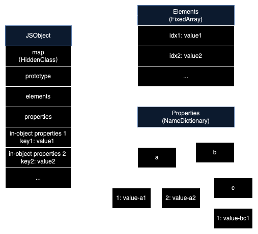

# V8 引擎

## V8 是什么

JS 有 ECMA 标准来指引它的一系列标准行为，比如模块加载规范、异步事件流程、各 API 不同输入下的表现等。但如何实现 JS 的标准行为，则由 JS 运行的宿主实现，宿主中管理和执行 JS 的模块称为 JS 引擎，而 V8 则是其中之一，其他 JS 引擎还有 Rhino、JavaScriptCore、Chakra 等。

V8 是 google 开源的 JS 引擎，由 C++ 编写，被应用于 Chrome、NodeJS 等应用，是目前应用最广泛的 JS 引擎。

## 查阅 V8 源码

V8 源码仓库：[https://github.com/v8/v8](https://github.com/v8/v8)

### JS API 对应的源码

JS 大部分内置的 API 实现都在 [/src/builtins](https://github.com/v8/v8/tree/14bc07d1427de50421a672cfac5ded5ae2ee7bda/src/builtins) 目录内，可通过 API 名搜索到源码。

比如数组的 map 方法，可以用 Array.prototype.map 关键字搜索，找到其源码位于 [/src/builtins/array-map.tq](https://github.com/v8/v8/blob/14bc07d1427de50421a672cfac5ded5ae2ee7bda/src/builtins/array-map.tq#L227)，注释处附有对应的 ecma 的标准文件 [sec-array.prototype.map](https://tc39.github.io/ecma262/#sec-array.prototype.map)。

其中 .tq 结尾的文件是以 Torque 语言编写（一种 V8 内部的 DSL），实际构建时会先被 [Torque 编译器](https://github.com/v8/v8/tree/14bc07d1427de50421a672cfac5ded5ae2ee7bda/src/torque) 转化为 C++ 代码，再最终编译为二进制的机器码。

### Mac 搭建调试环境

参考 v8 官方指引：[https://v8.dev/docs/source-code](https://v8.dev/docs/source-code)

1、下载调试工具 [depot_tools](https://commondatastorage.googleapis.com/chrome-infra-docs/flat/depot_tools/docs/html/depot_tools_tutorial.html#_setting_up)

2、安装 v8，关联依赖

```bash
$ cd depot_tools
$ fetch v8
$ gclient sync
```

3、编译

```bash
$ cd depot_tools/v8
$ tools/dev/gm.py arm64
```

编译产物默认在 `out/` 中，可用 `out/arm64.release/d8` 执行 JS 脚本。

4、输出 xcode 文件

```bash
$ cd depot_tools/v8
$ gn gen out/gn --ide="xcode"
```

输出的文件在 `out/gn`。

5、使用 xcode 调试

用 xcode 打开上一步输出的 `out/gn/all.xcodeproj` 文件。

xcode 工具栏 product -> scheme -> d8，启动编译并运行。

等待编译成功后，即可在 xcode 中的命令行执行 JS 脚本，并且可以用 xcode 在 v8 源码断点调试。

## 调试 V8

V8 原生提供了 debug API，[runtime.h](https://github.com/v8/v8/blob/master/src/runtime/runtime.h)中列出了所有的调试命令。

对于以 V8 引擎实现的应用，加上`--allow-natives-syntax`启动参数即可允许调试。

- node 可以通过`node --allow-natives-syntax`命令执行程序
- chromium 可以通过`open -a Chromium --args --js-flags="--allow-natives-syntax"`启动

有个 [jsvu](https://github.com/GoogleChromeLabs/jsvu) 开源库，可方便地下载不同 JS 引擎到本地进行调试。

## JIT（Just-In-Time）编译优化

### 解释执行 JS 过程

JS 是非编译型语言，其运行是直接执行源码，运行时在 JS 引擎内部实现”源码 -> AST -> 字节码 -> 汇编（机器码）“编译过程。

但如果在运行前，就对全部代码执行上述编译过程，会占用较长时间，且需要较大内存来保存编译后的机器码（越底层的代码越冗长）。所以通常 JS 引擎的实现是翻译到“字节码”这一层，然后边运行边翻译成“机器码”来执行。

### 预编译（TurboFan）

V8 引擎对这个过程做了 JIT 优化，即适时将某些较常运行的“字节码”优化并缓存，省去后续的编译耗时。

在 V8 中，解释执行“字节码”的模块是 Ignition，它在解释执行“字节码”的同时，也持续监控函数调用情况，当某个函数被高频调用且参数类型也稳定，它会认为这段“字节码”有优化必要，会将其优化并缓存优化结果供后续使用。

V8 初步优化“字节码”的动作叫 Baseline，它会尝试将“字节码”按固定参数类型优化，产物还是“字节码”，但执行速度相比“原始字节码“要快些。

如果函数依然被高频调用且入参稳定，V8 会将其更进一步优化为”机器码“，负责将“字节码”编译为“机器码”的动作叫做 TurboFan，被预编译的函数会得到 [TurboFanned](https://github.com/v8/v8/blob/c8fad7737ced5c262dee11610164f27a8ca155fe/src/runtime/runtime.h#L1019) 的状态，这里编译后的“机器码”其实还带了前置的、对函数入参的 checkpoint 判断。后续函数调用都会尝试用此机器码执行，但如果 checkpoint 阶段发现出现入参类型不同，无法直接用此“机器码”，则会回退到“原始字节码”执行。当多次出现这种回退，V8 会放弃这个编译优化。

对于编写代码的参考意义是：对于热点代码片段，可将其抽离成独立函数，并使其入参类型保持稳定。这样才能最大化利用 JIT 的优化。

`%GetOptimizationStatus`可以获取函数的优化状态，得到结果是一个最多 20 位的二进制数字，每一位的含义可参考 V8 源码的 [OptimizationStatus](https://github.com/v8/v8/blob/c8fad7737ced5c262dee11610164f27a8ca155fe/src/runtime/runtime.h#L1012)。比如 `100001` 表示进入了 TurboFan 优化（倒数第 6 位为 1）。

```js
const add = (a, b) => a + b;

console.log(%GetOptimizationStatus(add).toString(2)); // 1 --- 初始状态，无优化

for (let i = 0; i < 100000; i++) {
  add(1, 2);
}

console.log(%GetOptimizationStatus(add).toString(2)); // 100000000000001 --- Baseline 优化

for (let i = 0; i < 10000000000; i++) {
  add(1, 2);
}

console.log(%GetOptimizationStatus(add).toString(2)); // 110001 --- TurboFan 优化

add('1', '2');

console.log(%GetOptimizationStatus(add).toString(2)); // 1 --- 回退到无优化
```

破坏优化的一个例子，同样的两段逻辑，破坏优化后执行效率会显著降低：

```js
const add = (a, b) => a + b;

console.time('loop 1');
for (let i = 0; i < 1000000000; i++) {
  add(i, i);
}
console.timeEnd('loop 1'); // 477.609ms

// 破坏入参稳定性，回退到无优化状态
add('1', '1');

console.time('loop 2');
for (let i = 0; i < 1000000000; i++) {
  add(i, i);
}
console.timeEnd('loop 2'); // 2.044s
```

## 对象成员的存储优化

### 成员分类

因为 JS 里实现同一类对象的手段是”原型“，没有严格意义上的类，且对象成员（甚至其原型）可以在运行时变化，所以无法在编译时就为对象分配好固定的空间。所以只能在运行时，动态为对象每个成员分配空间，所以访问对象成员就有了位置查找的消耗。

V8 的对象以 3 类结构来存储成员数据

- elements: 索引属性，以数字为下标的成员
- properties: 命名属性，以常规字符串命名的成员
- inline-object properties: 直接存储于对象本身，线性空间，查找更快，但仅能存下少量数据，有较多限制。无法使用 inline-object properties 就会自动转存 properties



> 遍历对象的成员时（比如`Object.keys(obj)`），ECMA 标准规定一定是先遍历 elements，并且以数字升序顺序遍历，再遍历 properties，按声明顺序遍历。

### 隐藏类（HiddenClass）

对于 properties 数据，其存储是词典结构，查找成员有一定消耗，对于同一类对象的成员位置是固定的，每次都执行这样的查找有点多余。如果能有个缓存来记住每个成员的位置就好了。

V8 为每个对象创造了“隐藏类”，“隐藏类”中保存了 key（成员命名）和其对应的内存偏移值，知道 key 就能直接根据内存偏移值取到数据。对于有相同“隐藏类”的对象，其取值可省去一次查找的过程。“隐藏类”本身是线性空间，编译期 V8 会把对象的 key 编译为索引，与“隐藏类”的线性结构关联，所以对“隐藏类”本身的访问极快。

隐藏类是有序创建的，比如对于同样的一个初始对象，先赋值 a 再赋值 b，和先赋值 b 再赋值 a，两者最终得到的隐藏类是不同的。

对于编写代码的参考意义是：对于同一类对象，成员声明顺序应保持稳定，如果有空值也显式用 undefined 声明。这样才能尽可能利用隐藏类。

可以执行以下代码，观察隐藏类（`%DebugPrint` 返回的 map 地址）的复用情况：

```js
console.log('a -> b');

const obj1 = {};
obj1.a = 1;
// 生成隐藏类 Map(a)
obj1.b = 2;
// 生成隐藏类 Map(a, b)
%DebugPrint(obj1); // - map: 0x28d5385b7599 <Map(HOLEY_ELEMENTS)> [FastProperties]


console.log('b -> a');

const obj2 = {};
obj2.b = 2;
// 生成隐藏类 Map(b)
obj2.a = 1;
// 生成隐藏类 Map(b, a)
%DebugPrint(obj2); // map: 0x36c5d97f7629 <Map(HOLEY_ELEMENTS)> [FastProperties]


console.log('a -> b -> c');

const obj3 = {};
obj3.a = 1;
obj3.b = 2;
// 🌟 复用前面的 Map(a, b)
%DebugPrint(obj3); // - map: 0x28d5385b7599 <Map(HOLEY_ELEMENTS)> [FastProperties]

obj3.c = 3;
// 基于前面的 Map(a, b) 拓展出新的 Map(a, b, c)
%DebugPrint(obj3); // - map: 0x28d5385b7671 <Map(HOLEY_ELEMENTS)> [FastProperties]


console.log('a -> c vs a -> b -> c');

const obj4 = {};
obj4.a = 1;
obj4.c = 3;
// 生成隐藏类 Map(a, c)
%DebugPrint(obj4); // - map: 0x36c5d97f76b9 <Map(HOLEY_ELEMENTS)> [FastProperties]

const obj5 = {};
obj5.a = 1;
obj5.b = undefined;
obj5.c = 3;
// 🌟 复用前面的 Map(a, b, c)
%DebugPrint(obj5); // - map: 0x36c5d97f7671 <Map(HOLEY_ELEMENTS)> [FastProperties]


console.log('a + b vs b + a');

const obj6 = {
  a: 1,
  b: 2,
};
// 生成隐藏类 Map(ab)
%DebugPrint(obj6); // - map: 0x36c5d97f7749 <Map(HOLEY_ELEMENTS)> [FastProperties]

const obj7 = {
  b: 2,
  a: 1,
};
// 生成隐藏类 Map(ba)
%DebugPrint(obj7); // - map: 0x36c5d97f77d9 <Map(HOLEY_ELEMENTS)> [FastProperties]

const obj8 = {
  a: 1,
  b: 2,
};
// 🌟 复用隐藏类 Map(ab)
%DebugPrint(obj8); // - map: 0x36c5d97f7749 <Map(HOLEY_ELEMENTS)> [FastProperties]
```

也可以在 chrome 的 memory 抓取内存快照，查看对象的结构，其中`system / Map`指向的就是其隐藏类。


### 快属性（FastProperties）

在[成员分类](#成员分类)中有提到，对象的命名成员可能会被存储到 properties 或者 inline-object properties，当成员都被存储到 inline-object properties 时，即称这个对象拥有“快属性”。

“快属性”是以线性空间存储，直接可通过索引访问，因此访问最快。通常对对象成员的删除操作会破坏这个线性空间，此时 V8 会把成员全部转存到 properties 中，导致查找变慢。

执行以下代码，通过`%HasFastProperties`追踪此时对象是否具有“快属性”：

```js
const obj = {
  a: 1,
  b: 2,
  c: 3,
};

console.log(%HasFastProperties(obj)); // true - 简单对象初始拥有快属性

obj.xxx = 123;

console.time('loop 1');
for (let i = 0; i < 100000000; i++) {
  obj.c;
}
console.timeEnd('loop 1'); // 49.585ms

console.log(%HasFastProperties(obj)); // true - 增加一个成员后，依然拥有快属性

Reflect.deleteProperty(obj, 'a');

console.log(%HasFastProperties(obj)); // false - 删除一个成员后，破坏快属性

console.time('loop 2');
for (let i = 0; i < 100000000; i++) {
  obj.c;
}
console.timeEnd('loop 2'); // 472.515ms
```

### 快数组（FixedArray）

JS 中的数组其实也是对象的一种特殊表现形式，其主要使用对象的 elements 结构来存储数组数据。

V8 内部的数组有两种模式

- FixedArray：快数组，以类似传统数组的结构存储成员，有连续的空间，通过索引查找极快

- NumberDictionary：慢数组，以字典表的结构存储成员，索引仅是字典的键，查找有一定消耗

V8 会尽量地以“快数组”的模式实现数组，但如果数组并非紧密排列，则其可能会降级为“慢数组”模式，以节省不必要的空间占用。

```js
const arr = [1, 2, 3]; // 分配长度为 3 的 FixedArray
%DebugPrint(arr); // - elements: 0x1e013b9910e1 <FixedArray[3]>

arr.push(4, 5); // 加入两个成员，并自动预扩容为 23 的 FixedArray，剩下部份留空备用
%DebugPrint(arr); // - elements: 0x250961a49611 <FixedArray[23]> ... 5-22: 0x20b7a4681669 <the_hole>

console.time('loop 1');
for (let i = 0; i < 10000000; i++) {
  arr[1];
}
console.timeEnd('loop 1'); // 6.352ms

arr[2000] = 2000; // 转化为稀疏数组，以 NumberDictionary 结构存储
%DebugPrint(arr); // - elements: 0x250961a497c9 <NumberDictionary[52]>

console.time('loop 2');
for (let i = 0; i < 10000000; i++) {
  arr[1];
}
console.timeEnd('loop 2'); // 140.772ms
```


## 自动垃圾回收（GC、Garbage Collection）

V8 为便于 GC，采用了分代内存：

- 新生代区：大部分对象在此区，区域小但垃圾回收频繁
- 老生代区：从新生代晋升而来的生存周期长的对象
- 大对象区：占用空间较大的对象
- 代码区：唯一拥有执行权限的区域

> 考虑点：
> - 大部分对象在内存的存活时间很短，可能只被用一次即可废弃
> - 活跃的对象，预期其后续存活时间也会更长


nodeJS 中允许手动触发 GC：

```bash
$ node --expose-gc
> process.memoryUsage(); // 查看内存
> global.gc(); // 触发 GC
> process.memoryUsage(); // 再次查看内存
```

### 新生代区

采用复制算法（scavenge）做 GC

内存空间分为两半---from 区和 to 区，from 区是处于使用状态的内存，新对象都会分配到 from 区，当 GC 开始时，引擎会扫描出活跃对象（从 root 作用域开始，遍历其能访问到的所有对象，即为尚在活跃的对象），识别到活跃对象的同时，直接复制到 to 区，这样 to 区就都为活跃对象，然后交换 from 区和 to 区内容，释放 to 区。

由于此区大部分对象是非活跃，所以复制操作代价小，空间上有一半是处于空置状态（to 区），但因为此区空间本身就小，所以可以接受这种空置，这个牺牲带来的好处是只需要做一次扫描复制的遍历，并且复制后的内存自然紧密排列；而不用进行标记+清除两次遍历，且还产生内存碎片问题（清除后内存空间不连续）。

当此区的对象经过多次 GC 依然存活，说明其生命周期较长，对象会被移动到老生代区，此过程称为对象晋升。

### 老生代区

采用标记-清除算法（mark-sweep）做 GC

不再采用复制算法，因为此区空间较大，空置一半的空间太浪费，且大量活跃对象的复制代价大。此算法采用 DFS 遍历来标记活跃对象，标记结束后将非活跃对象（未被标记的对象）直接清除。

标记-清除操作会产生内存碎片，当内存空间不足时，执行标记-整理算法（mark-compact）来整理内存。

### STW（Stop-The-World）

垃圾回收过程需要完全暂停 JS 的执行，这个动作叫做 STW，如果垃圾回收耗时较长，会造成 JS 的卡顿。

新生代区由于空间较小，一般影响不大；老生代区则可能有较大影响。

为降低对老生代区的影响，V8 将标记过程拆分为多个子标记过程，让标记过程和 JS 逻辑交替执行，直到标记完成，此过程也称为“增量标记”。

为什么可以允许 JS 继续执行，这样打的标记不就不再可靠了吗？因为垃圾回收的特点是：宁愿放过，也不错杀。JS 的继续执行，只可能将原本标记为活跃的对象释放，而不可能将原本标记为废弃的对象继续使用。被误放过的对象会继续被下次的垃圾回收处理，没啥影响。
	
