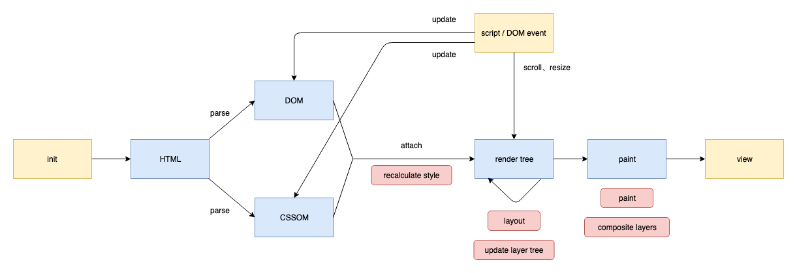
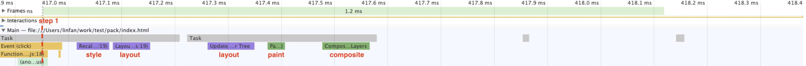
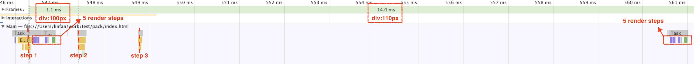
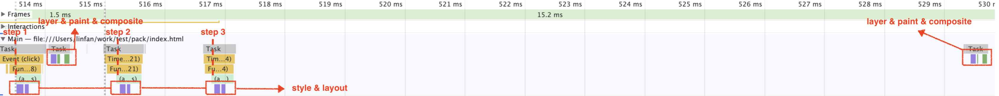
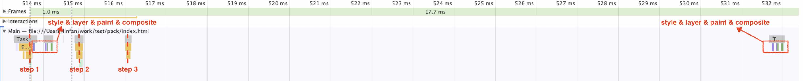
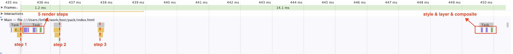
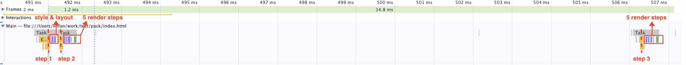
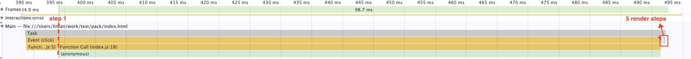

# 浏览器渲染

浏览器因内核不同对渲染的实现会略有差异，这里以chrome（blink）为例。

## 渲染步骤



渲染的几个关键步骤

1. recalculate style (style)：结合DOM和CSSOM，确定各元素应用的CSS规则
2. layout：重新计算各元素位置来布局页面，也称reflow
3. update layer tree (layer)：更新渲染树
4. paint：绘制各个图层
5. composite layers (composite)：把各个图层合成为完整页面

## 渲染过程

浏览器是足够聪明的，它会跳过不必要的渲染。当有DOM或者样式变化时，浏览器并不是立刻将改变渲染到屏幕上，而是把render flag标记为true。在**下一个渲染时机**如果判断此flag为true，就执行渲染并重置flag。所以两次宏任务之间不一定会发生渲染。渲染也是一轮独立的宏任务，任务下一般包含了layout、paint、composite等渲染所需步骤。**渲染和JS执行是互斥的**，计算会阻塞渲染，渲染也会阻塞计算。

**渲染时机**一般是下次屏幕刷新前，且主线程处于空闲状态。页面图像变化的间隔时间称为一帧，一帧的最小值一般为16.66ms（60Hz）左右，因硬件和软件配置而异，实际一帧也可能很长，比如这期间都没有动画需要执行。

渲染过程中，layout可能被**跳过**，比如对样式的修改不影响layout时，则只需repaint而不需reflow。可以借助 [CSS Triggers](https://csstriggers.com/) 查看哪些CSS属性会影响layout。paint也可能被跳过，比如只需重绘合成层的内容时。

有时渲染过程中的style、layout会被**提前**，而不是等渲染时机到达的这个宏任务才进行。比如修改了layout相关样式后，立刻**对layout相关属性进行了读取**，则浏览器也会立刻执行style和layout来返回准确的layout信息，但layout只是提前而非额外做，如果到渲染时机前都没有其他修改了，则直接根据这个layout结果进行layer之后的步骤。

重排（layout）最终一定会引发绘制（paint、composite），但并非每次重排都对应一次绘制。如果两次重排时间很近，小于一帧的时间，则只会到下一帧渲染前才绘制，且只绘制一次。

## GPU加速（硬件加速）

浏览器会按规则把页面分为多个图层。满足某些规则的节点会升级为合成层，交由GPU绘制，即硬件加速。最终呈现的页面是多个图层复合的结果。合成层上的某些样式变动只需重绘这个层，再把各层重新复合即可。

节点升级为合成层的情况有：

- transform
- opacity
- will-change
- canvas元素
- 有比自己index低的合成层
- etc.

符合此条件的元素，绘制逻辑会交给GPU，绘制结果可直接由GPU输出至浏览器页面，不再占用CPU资源。

一个例子：

```html
<!DOCTYPE html>
<html>
<head>
  <style>
    /* 普通元素 */
    #div1 {
      width: 100px;
      height: 100px;
      position: absolute;
      background: #eee;
      top: 0;
      left: 0;
      animation: left 1s infinite;
    }

    @keyframes left {
      0% {
        left: 0;
      }
      50% {
        left: 100px;
      }
      100% {
        left: 0;
      }
    }

    /* 合成层元素 */
    #div2 {
      width: 100px;
      height: 100px;
      position: absolute;
      background: #eee;
      bottom: 0;
      left: 0;
      transform: translateX(0);
      animation: transform 1s infinite;
    }

    @keyframes transform {
      0% {
        transform: translateX(0);
      }
      50% {
        transform: translateX(100px);
      }
      100% {
        transform: translateX(0);
      }
    }
  </style>
</head>
<body>
  <div id="div1"></div>
  <div id="div2"></div>
  <script>
    // 点击页面触发长时间 JS 计算，造成 JS 主线程阻塞：
    // #div1 的动画卡住不动，其绘制由 UI 线程（CPU）控制，需要等待 JS 线程让出控制权
    // #div2 的动画依然在流畅地进行，因其是在 GPU 绘制和输出
    document.addEventListener('click', () => {
      console.time('block');
      let i = 0;
      while (true) {
        i += 1;
        if (i > 1000000000) {
          break;
        }
      }
      console.timeEnd('block');
    });
  </script>
</body>
</html>
```

使用合成层能提高页面动画性能，但其创建需要额外开销，应结合实际需要合理利用。

## 结合例子


创建一个div为例子，在body的click事件对div进行修改

```js
// 创建测试div
const div = document.createElement('div');
div.style.cssText = 'width: 100px; height: 100px; background: red';
document.body.appendChild(div);

// 对div样式进行修改
document.body.addEventListener('click', () => {
  // ...
});
```

在click回调中，分别采用如下代码来测试，用chrome的performance工具分析结果。一个task条表示一轮事件循环，一个frame条表示实际一帧图像的持续时间。

### 1、单次渲染

```js
document.body.addEventListener('click', () => {
  div.style.height = '110px'; // step 1
});
```



一个基本的渲染例子，`step 1`之后浏览器执行了完整的5个渲染步骤。

### 2、多轮task下的渲染

```js
document.body.addEventListener('click', () => {
  div.style.height = '110px'; // step 1
  setTimeout(() => {
    div.style.height = '120px'; // step 2
    setTimeout(() => {
      div.style.height = '130px'; // step 3
    });
  });
});
```




同例子1，`step 1`之后，浏览器同样执行了完整的5个渲染步骤。

但`step 2`执行后并没有渲染，直到`step 3`执行后的一段时间才渲染，因为这时才到达渲染时机。

从frames栏看到，从`step 2`执行到`step 3`执行到再次渲染的这14.0ms期间，页面上显示的一直是110px的div，执行完第二次渲染后，直接变为130px的div。

可以再结合一个例子理解：

```js
setTimeout(() => {
  console.log('macro task 1');
  requestAnimationFrame(() => console.log('rAF 1'));
});
setTimeout(() => {
  console.log('macro task 2');
  requestAnimationFrame(() => console.log('rAF 2'));
});
```

执行结果是 macro task 1 - macro task 2 - rAF 1 - rAF 2。两轮时间间隔很近的宏任务，中间几乎没有时间插入渲染，所以两轮宏任务都执行完了才开始执行渲染。


### 3、提前读取layout相关属性

```js
document.body.addEventListener('click', () => {
  div.style.height = '110px'; // step 1
  console.log(div.offsetHeight);
  setTimeout(() => {
    div.style.height = '120px'; // step 2
    console.log(div.offsetHeight);
    setTimeout(() => {
      div.style.height = '130px'; // step 3
      console.log(div.offsetHeight);
    });
  });
});
```




对例子2稍加改动，在每个step后面都加上了对layout属性的读取。

结果是每次读取时，如果render flag为true，浏览器都会立刻强制执行style和layout来保证返回正确的数据。但仅提前了这2个步骤，后续步骤不变。


### 4、仅修改非layout相关属性

```js
document.body.addEventListener('click', () => {
  div.style.background = '#123'; // step 1
  setTimeout(() => {
    div.style.background = '#456'; // step 2
    setTimeout(() => {
      div.style.background = '#789'; // step 3
    });
  });
});
```



把例子2中对div的height属性改动变成对background属性（非layout相关属性）改动。

结果渲染过程跳过了layout这一步。

### 5、使用合成层

```js
document.body.addEventListener('click', () => {
  div.style.transform = 'scaleY(1.1)'; // step 1
  setTimeout(() => {
    div.style.transform = 'scaleY(1.2)';  // step 2
    setTimeout(() => {
      div.style.transform = 'scaleY(1.3)';  // step 3
    });
  });
});
```




把例子2中对div的height属性改动变成对tansform属性（合成层属性）改动。

执行`step 1`后，第一次渲染依然是5步完整的渲染步骤，因为此前div没有transform属性，还处于大图层中，这次渲染后才把div提升为合成层。

第二次渲染时，div已经是合成层，对合成层的transform改动不会影响其他图层，渲染过程跳过了layout和paint。


### 6、使用requestAnimationFrame控制时机

```js
document.body.addEventListener('click', () => {
  div.style.height = '110px'; // step 1
  requestAnimationFrame(() => {
    div.style.height = '120px'; // step 2
    requestAnimationFrame(() => {
      div.style.height = '130px'; // step 3
    });
  });
});
```




把例子2中各step的执行时机从setTimeout回调改为requestAnimationFrame（以下简称rAF）回调。rAF回调中的任务会在下个渲染时机执行。

`step 1`执行完后到达第一个渲染时机时，浏览器先执行了style & layout，接着不是执行layer，而是执行rAF任务（执行`step 2`并新增一个rAF任务），再重新进行渲染。然后是等到第二个渲染时机，执行第二个rAF任务（执行`step 3`），再进行渲染。

使用rAF替代定时器来实现动画，能保证rAF任务中的改动结果一定会被渲染，因为rAF任务的执行和渲染的频率是同步的，不会像例子2中`step 2`的改动被忽略，从而有更流畅的动画表现。当然这里讨论的是用JS去改样式，如果能直接用CSS的animation替代效果更佳。


### 7、阻塞渲染

```js
document.body.addEventListener('click', () => {
  div.style.height = '110px'; // step 1
  let i = 0;
  while (i++ < 100000000) {}
});
```



一轮task中如果进行了长耗时的计算，浏览器会一直等到计算完成才执行渲染，这会导致一帧图像持续的时间过长，也就是页面卡顿现象。

可以通过把任务拆分到多个task分段执行，或放到web worker执行来解决。

## 小结

- 避免频繁对layout相关属性的读取。
- 可以的话，样式需求优先用非layout相关属性去实现。
- 持续修改样式来实现动画时，使用requestAnimationFrame来替代定时器。
- 合理利用合成层（优先用transform实现动画；在合理时机设置节点的will-change；合成层的index尽可能调高，避免上层创建不必要的合成层）。
- 耗时较长的任务尽量拆分到多个task中分段执行，或放到web worker执行。

