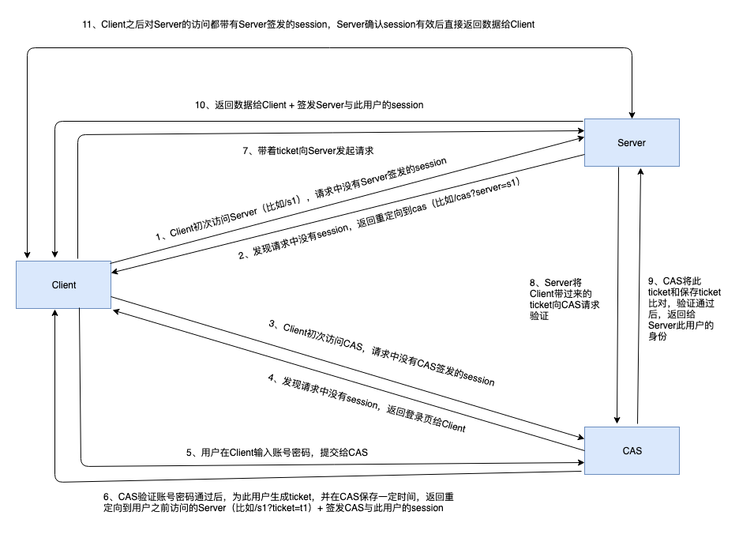

# 权限 & 认证

## OAuth2.0

用户、业务站点、账号站点

1、用户进入业务站点的某页面，需要账号站点的数据，业务调用账号站点api，如果未登陆或者token过期，跳转2，否则跳转6

2、业务站点把用户重定向到账号站点，并带上redirect参数

3、用户在账号站点操纵，完成登陆，服务器生成token

4、账号站点根据redirect参数，回到业务站点的页面，并带上token参数

5、业务站点得到token，与业务用户绑定，将用户重定向到最初的页面

6、此时业务站点已有token，带上token向账号站点发起请求，获取数据

此过程中，用户的账号密码信息只在账号站点提供的页面操作，完全不经过业务站点，可保证用户的信息安全。

## 集中式认证服务（CAS）



- 当Client没有Server的有效session，也没有CAS的有效session：1 -> 11。

- 当Client没有Server的有效session，但有CAS的有效session（比如之前登录过Server A，现在要登录Server B，Server A和B共用一套CAS）：1、2、3(带CAS的session)、6（验证session有效，直接生成ticket）、7、8、9、10、11

- 当Client有Server的有效session：11

实际场景中一条链路上可能有多层的Server，可以把此架构中的Client和Server看成整体，作为上层的Client，继续往下层的Server拓展。

## 登陆

登陆的一种实现：

Client
```
gen randomKey

encodeKey = psw

H(id+randomKey)
```
Server
```
decodeKey = psw

decode id + randomKey

encodeKey = randomKey

gen syncKey

H(syncKey)
```
Client
```
decodeKey = randomKey

decode syncKey
```

票据的一种实现：

登陆后，服务端生成票据，传给客户端保存，票据中记录登陆序列。若客户端数据泄露被copy进行登陆，服务端序列增加，下次客户端再次登陆，则因为序列对不上要求客户端输入密码重新登陆，重新生成票据。
