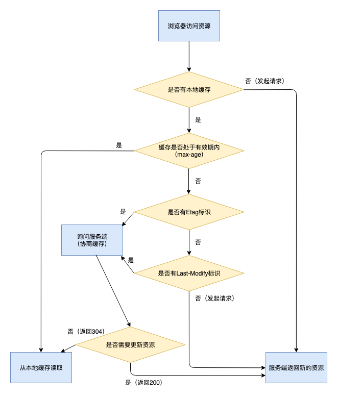

# 缓存

## HTTP协议的缓存

#### 缓存位置

service worker、memory（关闭tab清空）、disk

#### cache-control

- no-cache：有缓存，但使用前必须先和服务端协商

- no-store：禁止缓存

chrome中，除了no-store的情况，当前页多次同一资源的请求（无论同步异步）只会从网络获取一次，其余都从memory获取（且不显示在network），如果no-store，则多少请求就获取多少次