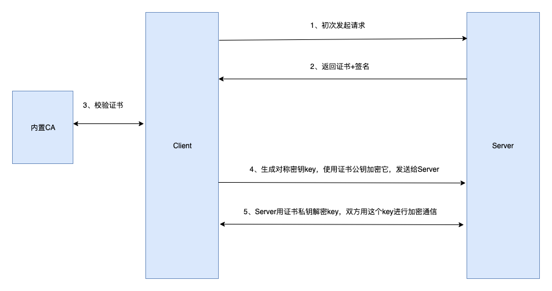

# 网络

## HTTP

应用层协议，基于传输层的tcp协议。

HTTP1.1默认keep-alive，可基于一次tcp（3次握手4次挥手）来发多次http请求。

### 内容

内容由version + header + body三部分组成。

req格式： 版本&路径+换行+头部+换行+body，例子：`HTTP/1.1 /index.html GET\r\nConnection: keep-alive`。

res格式：版本&状态码+换行+头部+换行+body，例子：`HTTP/1.1 200 OK\r\nContent-type: text/plain\r\n\r\nsome text here`

### 状态码

状态码12345对应含义：1未完成；2成功；3重定向、未修改等；4客户端错误；5服务端错误。

### header

content-type/accept-encoding/user-agent/cookie/access-control-allow-origin/cache-control/etag/connection

### 缓存相关

强缓存(cache-control的max-age)、协商缓存（etag/last-modified）、不缓存等。

### 跨域相关

access-control-allow-origin/access-control-allow-methods、OPTIONS类型（简单请求和复杂请求）

cookie：同源、cookie安全（same-site、http-only、csp策略）等。

### biz code in HTTP header vs body

可以类比TCP/QUIC，在 直接利用现有协议/在协议下层自定义封装 之间的取舍。

## TCP/UDP

都基于IP的传输层协议，传输数据给应用层协议使用。网络层IP+传输层端口来表示唯一连接。

因为两者都基于网络层的IP协议，都可能会出现丢包或乱序。而TCP与UDP不同的是，它在协议层封装了滑动窗口（超时重传来控制顺序、控制并发数来合理利用带宽）来解决这些问题。基于UDP也同样可以在应用层自行封装实现TCP的功能，比如QUIC。

## HTTPS

### 加密传输

HTTP是明文传输，网络传输过程中，中间人可以随意查看和篡改数据，有很大安全隐患。

HTTPS是**加密传输**，客户端和服务端用对称密钥进行加解密，不知道密钥的人无法查看和篡改数据。而如何保证这把对称密钥的安全则是HTTPS协议的关键。如果客户端和服务端是通过网络通信的方式商量密钥，有可能在一开始就被中间人介入，后面的加密也都是徒劳。

### 数字证书

HTTPS基于TLS，TLS引入了数字证书的概念，数字证书是由CA（Certificate Authority）发行的，证书遵循X.509规范。

数字证书的核心是一对非对称加密的**公私钥**，公钥随证书一起对外公开，私钥归证书持有者保管。公钥加密的内容，可认为仅能由私钥解开；公钥解密出来的内容，可认为是由私钥加密。数字证书还包含了域名、上级签发机构、有效期等信息。

> 公钥私钥涉及非对称加密的知识，相关内容详见[【内容加密】](./security.md#内容加密)

系统（或浏览器）内置了一些CA信任的根证书。根证书可以签发二级证书，二级可以签发三级证书，形成**证书链**。校验一个证书的有效性，可以由证书信息中获取上级签发机构，和系统证书池比对，如有则信任，如没有则继续请求上级签发机构证书，一直到和证书池匹配（成功），或者请求到根证书都未匹配（失败）。

关键点在于系统证书池是内置的，无论网站返回的证书是啥，最终都需要被系统证书信任才算有效。如果证书被中间人替换成同域名的伪造证书，或者替换成其他域名下的合法证书，系统校验都不会通过。所以只要系统不被篡改，通过校验的证书就一定可信。

> 比如使用whistle等抓包工具抓取https请求，本质上就是要把whistle变成合法中间人，使用whistle自己签发的同域名伪证书，所以必定有个前提是需要手动安装它提供的根证书到系统上。

### 建立连接过程

HTTPS首次建立连接（TLS1.2的握手）过程如下：

1. Client发起请求

2. Server收到请求，返回网站证书内容（包含域名、网站信息、签发机构信息、有效期等）和证书签名（对**证书内容hash**用证书私钥加密后得到的签名）

3. Client收到网站证书后，通过证书链，从**内置证书池**中，取出和网站证书对应的上级签发机构证书，通过上级证书提供的hash方法得到网站证书签名，并用公钥解密网站证书的签名，两者签名比对，若一致，则说明网站证书可信。

4. Client**生成对称密钥key**，将key用证书公钥加密后发给Server，此key仅有证书私钥方能解出来。

5. Server收到加密key后，用私钥解密出key，之后双方即可用这个key来进行加密通信。

TLS1.2需要2个RTT（证书确认、密钥确认），会话恢复时需要1RTT（跳过证书确认）；TLS1.3需要1个RTT（证书+加密一起确认），会话恢复时0RTT（直接在首次数据请求同时协商密钥）。加上TCP连接本身的一个RTT，所以整个HTTPS（基于TLS1.2的话）建立连接需要3个RTT。

## HTTP2

相比HTTP的改进点：

1. 编码方式：文本 => 二进制

2. 多路复用：一个tcp连接中同时发起多个http请求，而不是一个http请求完毕才能发下一个。

引入帧和流的概念。每个帧会带上自己属于哪个流的信息，因此不同流中的帧可以并行发送，即可以在同一个tcp连接中并发多个http请求，解决http1.1的头部阻塞问题。但tcp包丢失时导致的阻塞问题依然在，这点在HTTP3/QUIC中解决。

3. 头部压缩：客户端/服务端都维护一个headers索引表，请求不再每次都带上完整headers。

hpack算法

4. 主动推送：可以在客户端请求html时，把相关css、js也一并推送（需要服务端配置）

### 区分HTTP

HTTP2的headers风格是（冒号+）全小写+连字符，比如`:method`、`user-agent`等，HTTP1的风格是首字母大写+连字符。

HTTP2必须基于HTTPS，虽然HTTP2协议本身并不要求HTTPS，但各浏览器的实现都要求HTTP2必须用HTTPS。

## HTTP3(QUIC)

QUIC，基于UDP，自行实现类似TCP的数据可靠性。相当于在会话层/应用层实现部分传输层的功能。

HTTP2基于TCP的问题：TCP建立连接需要1.5RTT，且切换网络时需要重建连接；弱网环境下，TCP的重传导致拥塞等。

在HTTP3下：初次建立连接只需1RTT（UDP的0RTT+证书等配置确认1RTT），首次数据请求时协商密钥；会话恢复只需0RTT（跳过配置确认），直接发起数据请求（首次请求同时协商密钥）。

## websocket

和http一样基于tcp，http协议的升级，属于应用层协议。

tcp连接（连接实例称为socket）建立后，客户端发送http格式的报文`{ Connection: Upgrade, Upgrade: websocket, ... }`，服务端如果支持，也返回类似的确认报文，双方都对这个socket做好全双工通信的准备，即websocket连接建立。

### socket

套接字，一般由ip+端口　组成，可以理解为一个连接的实例。
比如说服务端客户端建立起一个tcp连接，那么两端各会有一个socket实例，可以对其调用各种方法来收发信息。

## RPC

远程过程调用(Remote Procedure Call)，指从一台计算机通过网络远程调用另一台计算机上的程序。因为调用方与被调用方不共享同一内存空间，不像本地调用函数时传参一样简单，需要解决寻址、序列化与反序列化等问题。

RPC框架是为解决调用问题所涉及的一整套方案，不单属于某一层的协议。框架需要包括寻址协议、序列化协议、传输协议，应用在企业内部一般还需包括日志记录、服务治理、容灾等常用功能。从定义上说，基于HTTP的WEB服务也可以算是RPC的一种实现。

## 七层模型

应用：http

会话：ssl/tls

传输：tcp/udp

网络：ip

