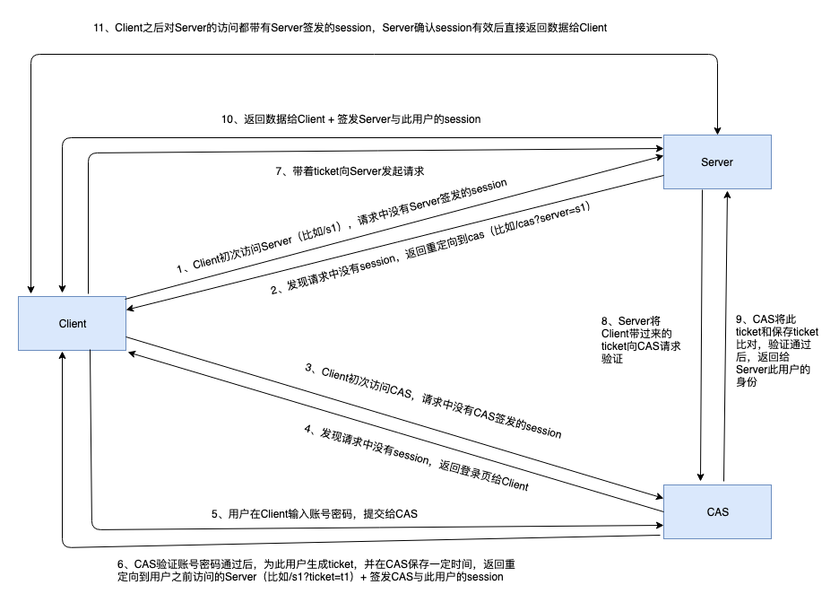

# 综合应用

## OAuth2.0

用户（浏览器端）、客户端（服务端）、第三方服务提供商（提供认证登陆和资源）

授权码模式:

1. 用户进入客户端，选择以第三方登陆，客户端将用户重定向到第三方(带有callback-url参数)。
2. 用户在第三方的页面上输入帐号密码完成登陆，第三方生成授权码，将用户重定向到刚才的callback-url回到客户端，并带上授权码参数。
3. 客户端接收到授权码，在后台向第三方发出请求，包含授权码和自身身份信息，第三方验证通过后，返回访问令牌给客户端。
4. 客户端将访问令牌与用户关联，此后客户端能通过该令牌请求第三方内容，即用户可在客户端上获取/操作自己在第三方的资源。

## 集中式认证服务（CAS）

- 当Client没有Server的有效session，也没有CAS的有效session：1 -> 11。

- 当Client没有Server的有效session，但有CAS的有效session（比如之前登录过Server A，现在要登录Server B，Server A和B共用一套CAS）：1、2、3(带CAS的session)、6（验证session有效，直接生成ticket）、7、8、9、10、11

- 当Client有Server的有效session：11

实际场景中一条链路上可能有多层的Server，可以把此架构中的Client和Server看成整体，作为上层的Client，继续往下层的Server拓展。

## 登陆

登陆的一种实现：

C

gen randomKey

encodeKey = psw

H(id+randomKey)

S

decodeKey = psw

decode id + randomKey

encodeKey = randomKey

gen syncKey

H(syncKey)

C 

decodeKey = randomKey

decode syncKey

票据的一种实现：

登陆后，服务端生成票据，传给客户端保存，票据中记录登陆序列。若客户端数据泄露被copy进行登陆，服务端序列增加，下次客户端再次登陆，则因为序列对不上要求客户端输入密码重新登陆，重新生成票据。
